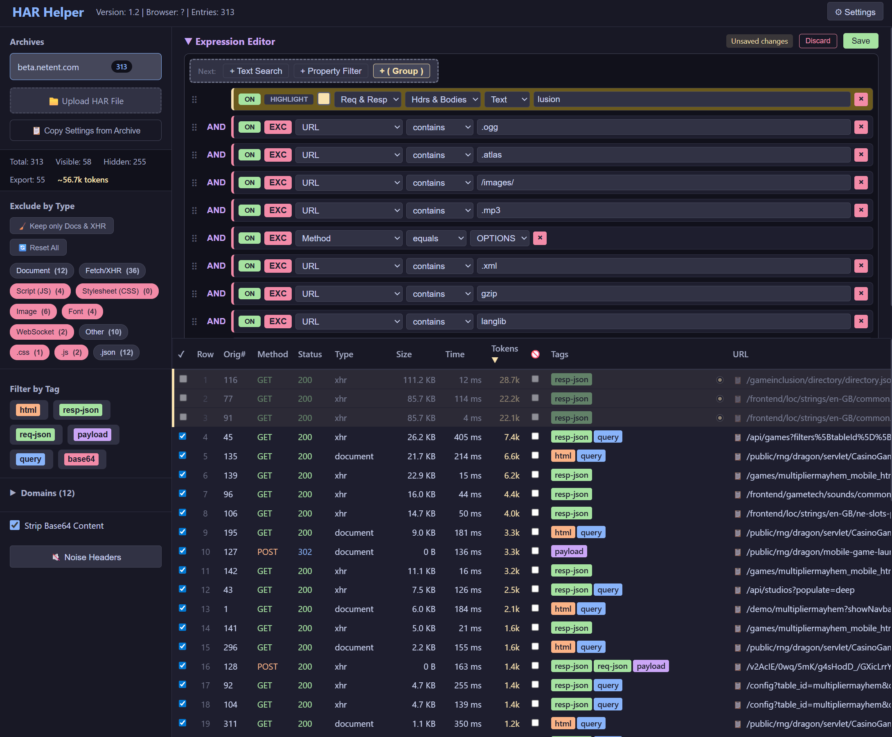

# HAR Helper

> Loading, filtering, inspecting, and exporting HAR (HTTP Archive) files — designed to help developers clean up network traffic data before **🤖 sharing it with AI assistants** or for debugging. 
> Think of this like 'fiddler' for AI, cleanup requests/responses feed it to AI.


---

## What it does

When you capture network traffic in Chrome DevTools and export it as a `.har` file, you often get hundreds of requests — images, fonts, scripts, analytics pings — that are irrelevant to what you actually want to analyze.

**HAR Helper** lets you:

- 📁 **Upload multiple HAR files** and switch between them
- 🔍 **Filter requests** with a powerful expression editor (text search, property filters, AND/OR groups)
- 🏷️ **Quick-filter** by resource type, file extension, content tag, or domain
- 🔇 **Suppress noise headers** (cache-control, user-agent, sec-fetch-*, etc.) from view and export
- 📋 **Copy filters** from one archive to another
- 📤 **Export a clean filtered HAR** — or an AI-optimized plain text version with estimated token count
- 🔎 **Inspect individual requests** with syntax-highlighted bodies, gzip decompression, and base64 decoding

---

## Quick Start

### Requirements

- Node.js 18+
- npm

### Install & Run

```bash
git clone https://github.com/oleksiivasylenko/har-helper.git
cd har-helper
npm install
npm run dev
```

Open **http://localhost:5173** in your browser.

### Allow chrome UN sanitaized HAR 


```

The built app is served at **http://localhost:3000**.

---

## Configuration

Copy `.env.example` to `.env` and adjust if needed:

```bash
cp .env.example .env
```

```env
AUTH_TOKEN=default-user-token-12345
PORT=3000
```

All data is stored locally in `data/har-helper.db` (SQLite). Nothing is sent to any external service.

---

## Features

| Feature | Description |
|---------|-------------|
| **Archive Management** | Upload `.har` files, switch between archives, delete archives |
| **Expression Editor** | Tree-based filter with text search, property filters, AND/OR groups, highlight-only mode |
| **Quick Filters** | One-click hide by resource type (XHR, script, image…) or file extension |
| **Tag Filters** | Filter by content type: `html`, `resp-json`, `req-json`, `payload`, `query`, `base64` |
| **Domain Filters** | Exclude specific hostnames from the view |
| **Noise Headers** | Built-in list of 40+ noisy headers; add custom ones; toggle per-archive |
| **Copy Settings** | Copy filters and export settings between archives (replace or merge) |
| **Export: Filtered HAR** | Download a clean `.har` with only selected entries and applied transformations |
| **Export: AI Text** | Download a compact plain-text version optimized for AI token efficiency |
| **Token Estimation** | Live estimate of export size in tokens (sidebar + export modal) |
| **Request Inspector** | Full request/response detail view with JSON highlighting, HTML rendering, gzip decode |
| **Entry Selection** | Per-row checkboxes to include/exclude individual entries from export |
| **Response Exclusion** | Exclude response body per entry while keeping the request |

---

## Documentation

Full documentation is in the [`docs/`](docs/README.md) directory:

- [Archive Management](docs/archives.md)
- [Filtering](docs/filtering.md)
- [Export](docs/export.md)
- [Noise Headers](docs/noise-headers.md)
- [Copy Settings](docs/copy-settings.md)
- [Request Inspector](docs/inspect.md)
- [Architecture & API Reference](docs/architecture.md)

---

## Tech Stack

- **Frontend**: [SolidJS](https://www.solidjs.com/) + TypeScript, built with [Vite](https://vitejs.dev/)
- **Backend**: [Express.js](https://expressjs.com/) (Node.js)
- **Database**: [sql.js](https://github.com/sql-js/sql.js) (SQLite, file-based, no install required)

---

## Contributing

Ideas, bug reports, and pull requests are welcome!

If you have a feature idea or found something that could be improved — open an issue or submit a PR. The project is intentionally simple and focused, so contributions that keep it lean and useful are most appreciated.

---

## FUTURE POSSIBLE IDEAS
- request history tree (how come we get here with this token etc.)
- api/mcp so AI can analize reuqest and ask details for some specific requests (not handling all requests inside context window)

## License

MIT
